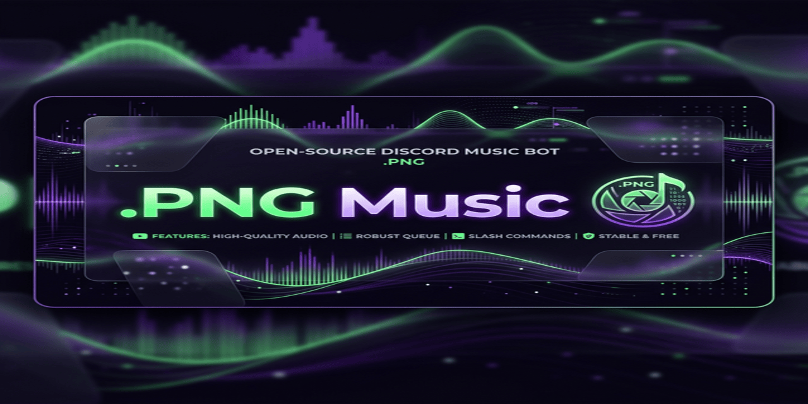

# 🎵 .PNG Music Bot

A professional-grade Discord music bot with a sleek **Spotify-inspired UI**, live progress bars, and support for both **Slash Commands** and **Legacy Prefix (`!`)** commands.

## ✨ Features
- **Spotify-Themed UI**: High-end interactive music controller with a live progress bar.
- **Dual Command Support**: Use `/play` or `!play`.
- **Hybrid Update Logic**: Buttons edit the controller instantly, while new songs jump to the bottom of the chat.
- **Smart Queue & Backlog**: Handles large playlists effortlessly by chunking them into manageable batches.
- **Idle Timeout**: Automatically leaves the voice channel after 2 minutes of inactivity.
- **Lavalink Powered**: High-fidelity audio playback using Shoukaku.

## 🚀 Deployment Guide

### Prerequisites
1. **Node.js**: v18 or higher.
2. **Java**: JRE 17+ (for Lavalink).
3. **Discord Bot Token**: Create one at the [Discord Developer Portal](https://discord.com/developers/applications).

### Setup Instructions
1. **Clone the Repo**:
   ```bash
   git clone https://github.com/your-username/png-music-bot.git
   cd png-music-bot
   ```
2. **Install Dependencies**:
   ```bash
   npm install
   ```
3. **Configure Environment**:
   Create a `.env` file in the root directory:
   ```env
   DISCORD_TOKEN=your_bot_token_here
   ```
4. **Setup Lavalink**:
   Ensure `Lavalink.jar` and `application.yml` are present. Run it once to verify:
   ```bash
   java -jar Lavalink.jar
   ```

### Running Locally
```bash
node index.js
```

### Hosting on Cloud (PM2)
We recommend using **PM2** for 24/7 hosting.
```bash
npm install -g pm2
pm2 start ecosystem.config.js
pm2 save
```

## 🛠 Commands
| Legacy | Slash | Description |
| :--- | :--- | :--- |
| `!play <query>` | `/play <query>` | Play a song or playlist |
| `!skip` | `/skip` | Skip the current track |
| `!stop` | `/stop` | Stop and leave the channel |
| `!loop <mode>` | `/loop <mode>` | Change loop mode (off/track/queue) |
| `!queue` | `/queue` | View the current queue |
| `!nowplaying` | `/nowplaying` | Show detailed track status |

## 📜 License
MIT License. Feel free to use and modify!
